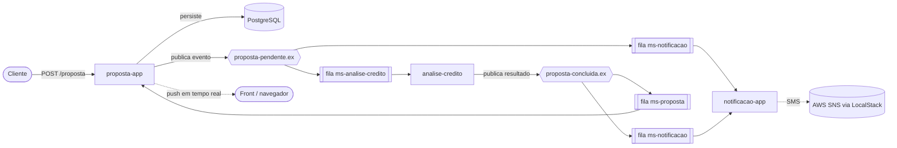

# Banking Credit Gateway

Sistema de análise de proposta de crédito construído em arquitetura orientada a eventos, com três microsserviços Spring Boot conversando de forma assíncrona por RabbitMQ. O cliente envia uma proposta, ela roda por uma esteira de análise de crédito baseada em Strategy Pattern, o resultado volta em tempo real pro front por WebSocket e o cliente é avisado por SMS em cada etapa.


## Objetivo

Prática e aprofundamento em tópicos que aparecem no dia a dia de um sistema distribuído: comunicação assíncrona, desacoplamento entre serviços, resiliência a falha e garantia de entrega de mensagem. Em vez de um monolito, quebrei o domínio em três serviços independentes, cada um com uma responsabilidade única, e usei o RabbitMQ como espinha dorsal da comunicação.

## Arquitetura

O fluxo inteiro é assíncrono. A API recebe a proposta, persiste e publica um evento. A partir daí, quem precisa reagir reage por conta própria, sem chamada HTTP direta entre os serviços.



As duas exchanges são do tipo **fanout**, ou seja, cada evento é entregue pra todos os consumidores interessados ao mesmo tempo. Quando uma proposta entra, tanto a análise de crédito quanto a notificação recebem o evento em paralelo. Quando a análise termina, o resultado vai de uma vez pro serviço de proposta (que atualiza o banco) e pro de notificação (que avisa o cliente).

## Os três microsserviços

### proposta-app

É a porta de entrada do sistema. Expõe a API REST, persiste as propostas no PostgreSQL, publica o evento inicial e consome o evento de resultado pra atualizar o status. Também é o dono de toda a topologia do RabbitMQ e o responsável por empurrar a atualização em tempo real pro front por WebSocket.

### analise-credito

O cérebro da regra de negócio. Recebe a proposta e roda uma esteira de estratégias de pontuação (Strategy Pattern) pra decidir se aprova ou rejeita. Não tem banco nem API, é um consumidor puro de fila que publica o resultado de volta.

### notificacao-app

Cuida da comunicação com o cliente. Consome os dois momentos do fluxo, proposta em análise e proposta concluída, e dispara SMS via AWS SNS. Também é um consumidor puro, sem banco nem API.

## Mensageria com RabbitMQ

Uma decisão que considero importante foi **centralizar toda a declaração da topologia em um único serviço**, o proposta-app. Ele declara as duas exchanges de negócio, a exchange de dead letter, as quatro filas de trabalho e todos os bindings no startup, via `RabbitAdmin` disparado no `ApplicationReadyEvent`. Os outros dois serviços não declaram nada, só conhecem o nome da fila que consomem e da exchange onde publicam. Isso evita divergência de configuração entre serviços e deixa claro quem é o dono do contrato.

O transporte das mensagens é feito em JSON, com um `JacksonJsonMessageConverter` configurado em cada serviço. Outro cuidado foi **desacoplar os contratos**: a mensagem que trafega no barramento nunca é a entidade de persistência. Cada serviço tem seu próprio DTO de mensagem, então mudar uma coluna do banco não quebra o contrato de integração.

## Resiliência: retry, DLX e DLQ

Fila sem tratamento de erro vira um problema silencioso, então cada fila de trabalho tem sua própria rede de segurança. Configurei retry automático de até três tentativas por mensagem. Se depois disso a mensagem ainda falhar, ela não fica em loop infinito de reprocessamento nem some: ela é encaminhada pra uma **Dead Letter Queue** através de uma **Dead Letter Exchange** direta.

Na prática, cada uma das quatro filas aponta pra DLX com uma routing key própria, e cada DLQ fica bindada nessa DLX pela mesma chave. Assim eu consigo isolar exatamente qual etapa do fluxo falhou olhando em qual DLQ a mensagem parou. Também desliguei o requeue automático em falha pra garantir que a mensagem envenenada vá pra DLQ em vez de voltar pra fila.

## Garantia de entrega com padrão outbox

Publicar em fila pode falhar mesmo depois da proposta já ter sido salva no banco. Pra não perder o evento nesse cenário, cada proposta carrega uma flag `integrada`. Quando a publicação dá certo, ela nasce como `true`. Se a publicação falha, ela é marcada como `false` e persistida assim mesmo.

Um agendador roda a cada dez segundos, busca todas as propostas com `integrada = false` e tenta reenviar o evento, marcando como integrada quando consegue. Esse é o padrão de outbox aplicado de forma simples: o banco vira a fonte da verdade e o sistema se recupera sozinho de uma indisponibilidade momentânea do broker, sem intervenção manual.

## Análise de crédito com Strategy Pattern

A pontuação da proposta é calculada por várias estratégias independentes, cada uma implementando a mesma interface `CalculaPontuacao`. Tem estratégia pra score de mercado, para renda contra valor solicitado, prazo de pagamento, outros empréstimos em andamento e checagem de nome negativado.

O ponto elegante é que o serviço de análise não conhece nenhuma implementação concreta. Ele recebe uma `List<CalculaPontuacao>` injetada pelo Spring, que coleta automaticamente todos os beans que implementam a interface, soma as pontuações e decide o resultado por um limiar. Adicionar uma nova regra de crédito é só criar uma nova classe anotada, sem tocar em uma linha do serviço. Uma das estratégias pode interromper a análise na hora lançando uma exceção de negócio dedicada, o que representa um bloqueio imediato, por exemplo um CPF negativado.

## Notificação por SMS com AWS SNS e LocalStack

O disparo de SMS usa o Amazon SNS através do SDK oficial da AWS. Pra desenvolver e testar sem custo e sem depender de conta real, todo o SNS roda localmente via LocalStack, que emula o serviço da AWS na sua máquina. O cliente SNS aponta pro endpoint local por configuração, então trocar do LocalStack pra AWS de verdade é só mudar variável de ambiente, sem mexer no código.

Vale registrar a decisão de segurança: nenhuma credencial da AWS fica versionada. Em ambiente local o LocalStack aceita credenciais fictícias, e em produção a autenticação viria por variável de ambiente ou pela cadeia de credenciais padrão da AWS.

## Atualização em tempo real com WebSocket

Depois que a análise termina, o front não precisa ficar dando refresh pra ver o resultado. O proposta-app expõe um endpoint WebSocket com STOMP sobre SockJS, e assim que o status da proposta é atualizado pelo evento de conclusão, o serviço faz um push pro tópico que o front está inscrito. O resultado aparece na tela na hora.

## Decisões técnicas que valem destacar

Trabalhei com valores monetários usando `BigDecimal` e comparação por `compareTo`, evitando os problemas clássicos de precisão do `double` e a comparação por `equals` que considera escala. Separei três representações distintas do mesmo dado, a entidade de persistência, o DTO de mensagem e o DTO de resposta da API, pra que cada camada evolua sem arrastar as outras. Externalizei todos os nomes de filas e exchanges pro arquivo de configuração, referenciando por propriedade no código, o que deixou a topologia visível e fácil de ajustar por ambiente.

## Como rodar

Tudo sobe com um comando. O Compose levanta a infraestrutura (PostgreSQL, RabbitMQ e LocalStack) e os três microsserviços, já conectados na mesma rede.

```bash
docker compose up --build
```

Cada serviço tem um Dockerfile em dois estágios: o primeiro compila o jar com Maven e JDK 17, e o segundo copia só o jar pra uma imagem enxuta que roda apenas a JRE. Dentro da rede do Compose os serviços se enxergam pelo nome, então os hosts do banco, do broker e do SNS são injetados por variável de ambiente, sem alterar o arquivo de configuração usado no desenvolvimento local.

Painéis e portas úteis depois de subir:

```text
API de proposta        http://localhost:8080/proposta
Painel do RabbitMQ     http://localhost:15672  (guest / guest)
Endpoint do LocalStack http://localhost:4566
```

Exemplo de criação de proposta:

```bash
curl -X POST http://localhost:8080/proposta \
  -H "Content-Type: application/json" \
  -d '{
        "nome": "Ana",
        "sobrenome": "Souza",
        "telefone": "11999999999",
        "cpf": "12345678901",
        "renda": 5000,
        "valorSolicitado": 1000,
        "prazoPagamento": 24
      }'
```

## Testes

O projeto tem uma suíte de testes unitários com JUnit 5 e Mockito cobrindo a lógica de negócio dos três serviços, sem precisar subir nenhuma infraestrutura. Os testes isolam as regras de aprovação e rejeição da análise de crédito, as estratégias de pontuação determinísticas, a conversão de status em resposta da API, o comportamento de garantia de entrega no serviço de proposta e a escolha da mensagem de SMS em cada etapa.

```bash
cd analise-credito && ./mvnw test
cd ../proposta-app && ./mvnw test
cd ../notificacao-app && ./mvnw test
```

## Stack

Java 17, Spring Boot, Spring AMQP, RabbitMQ, PostgreSQL, AWS SNS, LocalStack, WebSocket com STOMP, Docker e Docker Compose, Maven, JUnit 5, Mockito e Lombok.
